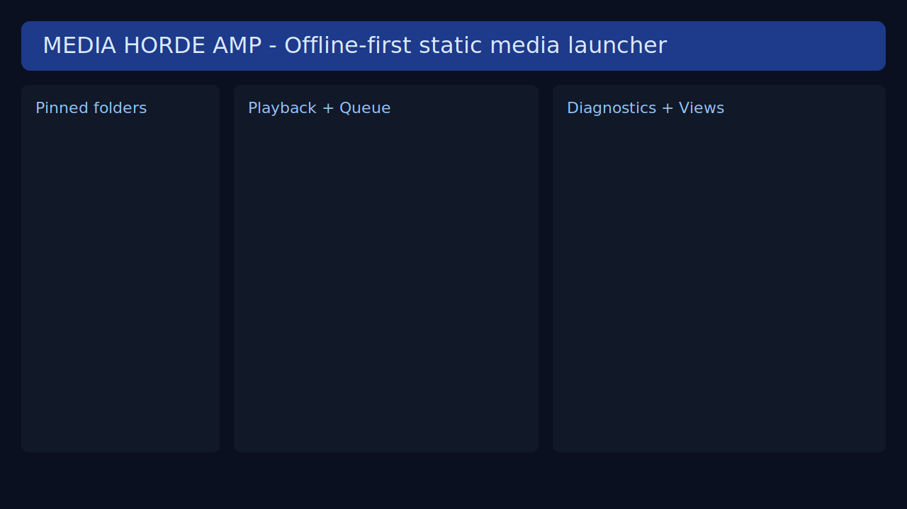

# Media Horde AMP

Offline-first media launcher for static hosting. Load a `playlist.txt` and browse huge local libraries without a backend.




## Project identity

Media Horde AMP is built for **offline-first**, **static hosting**, and **big local collections**:
- Works from a plain folder, local server, or GitHub Pages.
- Keeps UI state in local storage (favorites, recents, pinned folders, volume, view mode).
- Avoids server dependencies and supports manual `playlist.txt` loading.

## Current features

- Audio/video/html launching from `playlist.txt`
- Search (debounced), sort, filter, and folder browsing
- Table/List/Grid view switching
- Favorites + recents + recently-added filter
- Pinned folders (right-click in sidebar)
- Up Next queue + repeat modes (`off`, `one`, `all`)
- Multi-select with bulk queue/favorite actions
- Drag-and-drop playlist loading
- Playlist diagnostics modal for malformed lines and duplicates
- Render cap to stay responsive with very large libraries

## Playlist format

```txt
relative/path/to/file.ext | key=value | key=value
```

Example:

```txt
music/song.mp3
videos/demo.mp4 | title=Cool Demo | size=42 MB
games/game/index.html | title=My Game | type=html
music/song.mp3 | art=covers/song.jpg
```

Supported metadata keys: `title`, `type`, `folder`, `size`, `art`, `cover`, `ext`.

## Builder tool (`tools/build_playlist.py`)

```bash
python tools/build_playlist.py --scan-root . --output playlist.txt
```

Useful options:

```bash
python tools/build_playlist.py --dry-run
python tools/build_playlist.py --report report.json
python tools/build_playlist.py --json-output playlist.json
python tools/build_playlist.py --extension .mp3 --extension .mp4
python tools/build_playlist.py --extensions .mp3,.flac,.mp4
python tools/build_playlist.py --exclude temp --exclude cache
python tools/build_playlist.py --no-size
```

## Repo layout

```txt
.
├─ index.html
├─ playlist.txt
├─ README.md
├─ CHANGELOG.md
├─ ROADMAP.md
├─ assets/
│  ├─ css/styles.css
│  ├─ img/media-horde-amp-banner.svg
│  └─ js/{config,utils,playlist,player,ui,app}.js
├─ tools/
│  ├─ build_playlist.py
│  ├─ build_playlist.bat
│  └─ build_playlist.ps1
├─ tests/
│  ├─ test_build_playlist.py
│  └─ test_playlist_parser.js
└─ .github/
   ├─ workflows/checks.yml
   └─ ISSUE_TEMPLATE/{bug_report,feature_request}.md
```

## Known limitations

- Large libraries are capped to first visible rows for rendering; full virtualization is not implemented yet.
- Repeat `off` currently still advances when the player fires `ended` (tracked for follow-up).
- Album art fallback is heuristic-based and may not always find the best match.
- Browser security policies may block autoplay or local `file://` fetches depending on browser settings.

## Development checks

```bash
python -m pytest -q
node tests/test_playlist_parser.js
```
